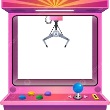

# Portfolio Arcade Interactif

Un portfolio créatif au style arcade présentant mes compétences et projets à travers une interface interactive et ludique inspirée des salles d'arcade.



## Présentation

Ce portfolio est conçu comme une salle d'arcade virtuelle où chaque installation représente une facette différente de mon travail et de mes compétences. Les visiteurs peuvent explorer différentes "machines" pour découvrir mes projets et créations.

## 🎮 Fonctionnalités

### Expérience Arcade Immersive
- **Hall principal** avec navigation intuitive
- **Changement de thème** entre mode sombre et mode clair
- **Effets visuels** dynamiques et animations

### 🎲 Installations Interactives
1. **Machine à pince** : Attrapez et découvrez mes modèles 3D Blender
2. **Galerie d'art** : Explorez mes créations avec une lampe torche virtuelle
3. **Borne d'arcade** : Visualisez mes projets de jeux vidéo
4. **Projecteur** : Visionnez mes scènes et environnements réalisés avec Unreal
5. **Laboratoire** : Mélangez des "fioles" pour voir différentes démos créatives

### Interface Utilisateur
- **Carte de navigation** pour se déplacer entre les zones
- **Personnage d'information** inspiré des Sims pour présenter mon profil
- **Contrôles audio** pour la musique d'ambiance
- **Transitions fluides** entre les différentes zones

### 🔍 Easter Eggs
Plusieurs surprises cachées sont disséminées à travers l'interface pour les visiteurs curieux !

## 🛠Technologies Utilisées

- **HTML5** - Structure du site
- **CSS3** - Style et animations
- **JavaScript** - Interactivité et dynamisme
- **Model Viewer** - Affichage des modèles 3D
- **Font Awesome** - Icônes
- **Google Fonts** - Typographie

## Comment Utiliser

1. **Navigation** : Utilisez la carte ou cliquez sur les machines pour explorer les différentes zones
2. **Interactivité** :
   - Contrôlez la pince avec les flèches du clavier ou les boutons à l'écran
   - Déplacez la souris pour explorer la galerie avec la lampe torche
   - Cliquez sur les différents éléments pour afficher plus d'informations
3. **Thèmes** : Basculez entre le mode sombre et le mode clair avec le bouton thème
4. **Audio** : Activez/désactivez la musique de fond avec le bouton audio

## Notes d'Adaptation

Le portfolio est entièrement responsive et s'adapte aux différentes tailles d'écran :
- **Ordinateur** : Expérience complète avec toutes les animations
- **Tablette** : Interface adaptée avec contrôles tactiles
- **Mobile** : Version simplifiée mais conservant l'esthétique arcade

## Compatibilité Navigateurs

- Chrome (recommandé)
- Firefox
- Safari
- Edge

## Installation

1. Clonez ce dépôt :
```bash
git clone https://github.com/votre-nom/portfolio-arcade.git
```

2. Naviguez vers le répertoire du projet :
```bash
cd portfolio-Creatif
```

3. Ouvrez `index.html` dans votre navigateur ou utilisez un serveur local comme Live Server dans VS Code.

## 📂 Structure du Projet

```
portfolio-Creatif/
├── index.html        # Page principale
├── styles.css        # Styles globaux
├── script.js         # JavaScript principal
├── easter-eggs.js    # Fonctionnalités cachées
├── audio/            # Fichiers audio
├── img/              # Images et textures
├── models/           # Modèles 3D
└── video/            # Vidéos des projets
```

## Crédits et Inspirations

- Design inspiré des salles d'arcade rétro-futuristes
- Esthétique néon inspirée du style synthwave
- Interface de personnage inspirée par Les Sims

- Modèles 3D

Modèle "Navet" utilisé dans mes scènes Unreal par Nicolas Pertuy sur Sketchfab sous licence CC Attribution
Divers modèles natifs disponibles dans Unreal Engine

- Démos et Framework

Démos GL4D basées sur le framework fourni par Prof. Farès Belhadj (Université Paris 8)

## 📝 Licence

Ce projet est sous licence MIT. Voir le fichier LICENSE pour plus de détails.

---

Créé par Dounia Hullot
